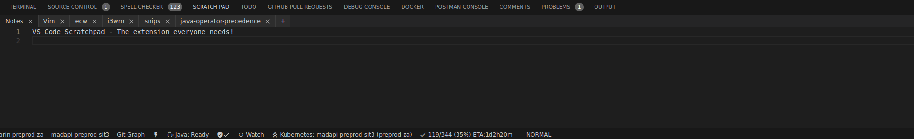

<!-- @format -->

# Scratch Pad for VS Code

Scratch Pad is a simple, yet powerful extension for Visual Studio Code that provides a convenient space for quick notes, code snippets, and temporary text alongside your workspace.

This came from need I'd had for a long time - opened a feature request on vs code (VS Code issue)[https://github.com/Microsoft/vscode/issues/58774] but it wasn't approved, so I went ahead to create one

## Features

-   **Persistent Scratchpad**: A dedicated space for notes that persists between VS Code sessions.
-   **Convenient Location**: Sits right next to your terminal for easy access.
-   **Auto-save**: Your notes are automatically saved as you type.
-   **Theme-matched**: Automatically matches your VS Code theme for a seamless look.

## Requirements

This extension requires Visual Studio Code version 1.60.0 or higher.

## Installation

1. Open VS Code
2. Press `Ctrl+P` (or `Cmd+P` on macOS) to open the Quick Open dialog
3. Type `ext install scratch-pad` and press Enter
4. Restart VS Code

## Usage

1. Click on the Scratch Pad icon in the panel area (where Terminal and Output views are located)
2. Start typing your notes or pasting your snippets
3. Your content is automatically saved

## Extension Settings

This extension contributes the following settings:

-   `scratchPad.fontSize`: Set the font size for the scratch pad (default: matches editor font size)
-   `scratchPad.fontFamily`: Set the font family for the scratch pad (default: matches editor font family)

## Known Issues

-   Syncing functionality is not yet implemented.

## Release Notes

### 1.3.2

-   Bug fixes and performance improvements

### 1.3.0

-   Upgraded scratchpad to fully featured editor to support advanced features

### 1.2.0

-   Moved persistent mechanism from local file to globalUpdate to take advantage of Setting Sync

### 1.0.0

Initial release of Scratch Pad:

-   Persistent scratchpad in the panel area
-   Auto-save functionality
-   Theme-matching appearance

## Roadmap

Future plans for Scratch Pad include:

-   [ ] Online synchronization
-   [ ] Multiple scratchpads
-   [ ] Markdown support
-   [ ] Code snippet formatting
-   [ ] Manage Secrets
-   [ ] Named Snippets
-   [ ] Labels and tags

## Contributing

If you have suggestions for improvements or bug fixes, please feel free to contribute! Here's how:

1. Fork the repository
2. Create your feature branch (`git checkout -b my-new-feature`)
3. Commit your changes (`git commit -am 'Add some feature'`)
4. Push to the branch (`git push origin my-new-feature`)
5. Create a new Pull Request

Before submitting your pull request, please make sure your changes are consistent with the project's coding style and that all tests pass.

## License

This project is licensed under the MIT License - see the [LICENSE](LICENSE) file for details.

## Support

If you encounter any problems or have any suggestions for improvements, please [open an issue](https://github.com/folarinmartins/vscode-scratch-pad/issues) on our GitHub repository.

---

**Enjoy your new Scratch Pad!**
